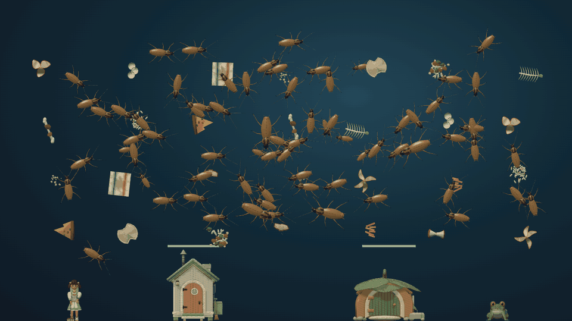

# Desktop Creatures / 桌面生物

[简体中文 (default)](README.md) · [English](README.en.md)

A public source snapshot of the Windows transparent 3D desktop game, based on the r21 full-screen-menu code. A cleaner and a frog clear litter, catch insects, and defend their homes while the player uses tools, upgrades, and local saves. This snapshot contains only current production candidate source and runtime assets. Historical characters, the noncommercial R19 model, reference art, and development archives are excluded.

> **Status:** a Windows preview download is available; native manual acceptance remains incomplete, and this is not a Steam release. Code is [MIT licensed](LICENSE). Project-created original assets are [CC BY 4.0](ASSETS-LICENSE.md), existing CC0 assets remain CC0, and third-party components keep their own licenses. See the [license notes](docs/licenses.md).

## Download for Windows

Download `Desktop-Creatures-v1.1.0-preview.1-Windows-x64.zip` from the [Releases page](https://github.com/AdrianZhaoDev/desktop-creatures/releases/tag/v1.1.0-preview.1), extract the entire archive, and double-click `desktop-creatures.exe`. Windows 11 x64 and WebView2 Runtime are required. This preview is unsigned and may trigger Windows SmartScreen. Press `F12` to hide the overlay immediately. The archive includes license and third-party notices.

## Actual gameplay visuals



The GIF preserves the project owner's full Codex desktop screenshot (conversation, GitHub page, and taskbar) and overlays animation captured from the public game's real renderer. It is not a live recording of the Codex window. The dense prepared state contains 72 insects, 28 pieces of litter, two characters, and two houses; playback is sped up and does not represent the default opening scene. The game menu is closed. [Screenshot and GIF rights notice](docs/screenshots/NOTICE.md).

## Build and run

Requirements: Windows 11 x64, Node.js 24, npm 11, Rust 1.98.1 MSVC, Visual Studio C++ x64 tools, Windows 11 SDK 26100, and WebView2 Runtime. In a **complete clone**:

```powershell
npm ci
npm run check
npm run steam:candidate -- --output .steam-candidate-public
```

To build it yourself, the controlled native build needs cached locked Rust dependencies and a new output path. See the [native candidate guide](release/steam/NATIVE-CANDIDATE.md) for requirements and parameters:

```powershell
$candidate = (Resolve-Path .steam-candidate-public).Path
$nativeOutput = Join-Path (Get-Location) '.steam-native-public'
node release/steam/build-native-candidate.mjs --candidate $candidate --output $nativeOutput
& (Join-Path $nativeOutput 'content/desktop-creatures.exe') --steam-preview
```

To verify only the frontend candidate, run `npm run steam:candidate -- --verify .steam-candidate-public`. The candidate process checks per-file SHA-256 hashes, dependency closure, and generated output. Windows click-through, focus, and tray behavior still need manual desktop verification. `F12` is the emergency-hide shortcut.

## Source and contributions

- `src/campaign/`: campaign rules, rendering, and bilingual UI; `src-tauri/`: native Windows layer.
- `assets/`: controlled runtime assets; `release/steam/`: fixed inventory and build verification.
- [Contributing](CONTRIBUTING.md) · [License](LICENSE) · [中文 README](README.md)
