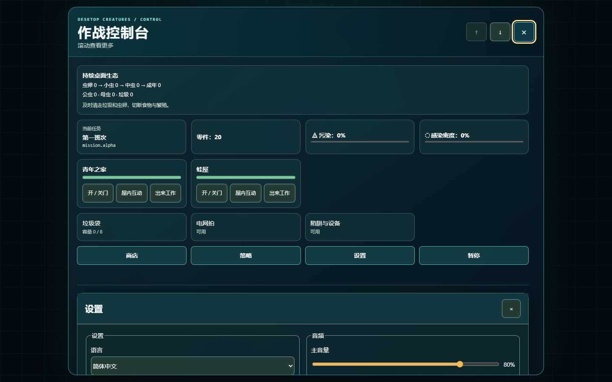
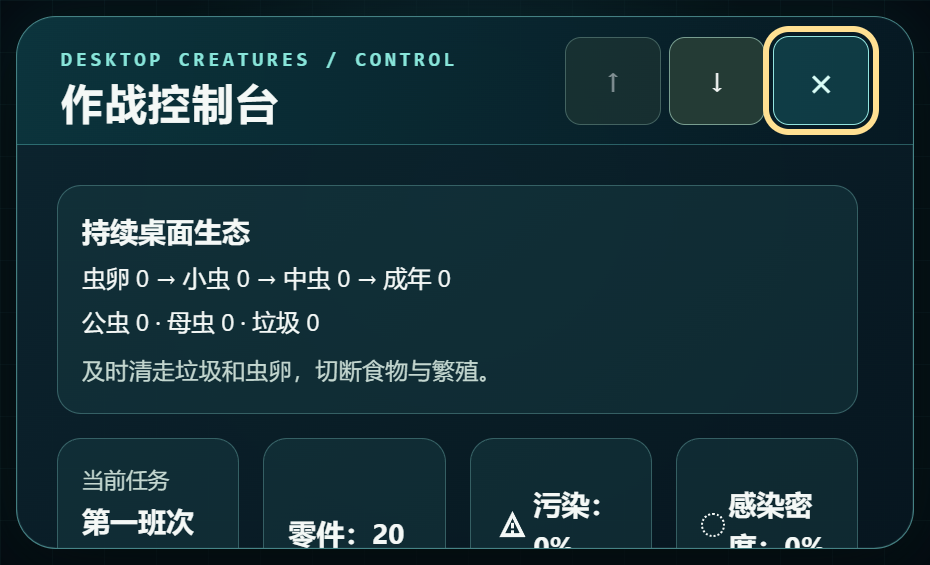
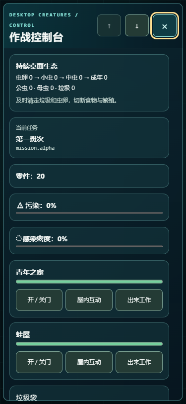

# 桌面生物 / Desktop Creatures

[简体中文（默认）](README.md) · [English](README.en.md)

Windows 透明桌面 3D 生物游戏的公开源码快照，基于 r21 全屏菜单版代码。人偶与青蛙会清洁桌面、捕虫、守护房屋；玩家可以使用工具、升级并保存本地进度。此快照只包含当前生产候选所需源码与运行素材，不包含历史角色、非商用 R19 模型、参考图或开发压缩包。

> **状态**：这是本地试玩源码，不是已通过 Steam 或完整原生人工验收的发行版。代码为 [MIT](LICENSE)；项目原创素材按 [CC BY 4.0](ASSETS-LICENSE.md) 发布，原已标 CC0 的素材继续按 CC0，第三方组件依各自许可。详情见 [许可说明](docs/licenses.md)。

## 示例图

| r21 全屏菜单 | 200% 缩放 |
| --- | --- |
|  |  |



图像来自 r21 浏览器菜单验证。公开快照已把运行时 R19 角色替换成原有 S06 模型，因此截图只用于展示未改动的菜单，不展示当前角色外观。

## 构建并运行

需要 Windows 11 x64、Node.js 24、npm 11、Rust 1.98.1 MSVC、Visual Studio C++ x64 工具、Windows 11 SDK 26100 和 WebView2 Runtime。先在**完整克隆**中执行：

```powershell
npm ci
npm run check
npm run steam:candidate -- --output .steam-candidate-public
```

原生受控构建需要本机已缓存的锁定 Rust 依赖，且输出目录必须尚不存在。具体参数和环境要求见 [原生候选说明](release/steam/NATIVE-CANDIDATE.md)：

```powershell
$candidate = (Resolve-Path .steam-candidate-public).Path
$nativeOutput = Join-Path (Get-Location) '.steam-native-public'
node release/steam/build-native-candidate.mjs --candidate $candidate --output $nativeOutput
& (Join-Path $nativeOutput 'content/desktop-creatures.exe') --steam-preview
```

若只想验证前端候选，可运行 `npm run steam:candidate -- --verify .steam-candidate-public`。候选会校验逐文件 SHA-256、依赖闭包和生成结果。Windows 覆盖层的鼠标穿透、焦点和托盘行为还需在实际桌面人工检查；紧急隐藏键为 `F12`。

## 源码结构与贡献

- `src/campaign/`：战役规则、渲染和中英 UI；`src-tauri/`：Windows 原生层。
- `assets/`：受控运行素材；`release/steam/`：固定清单和构建验证器。
- [贡献指南](CONTRIBUTING.md) · [许可证](LICENSE) · [英文 README](README.en.md)
